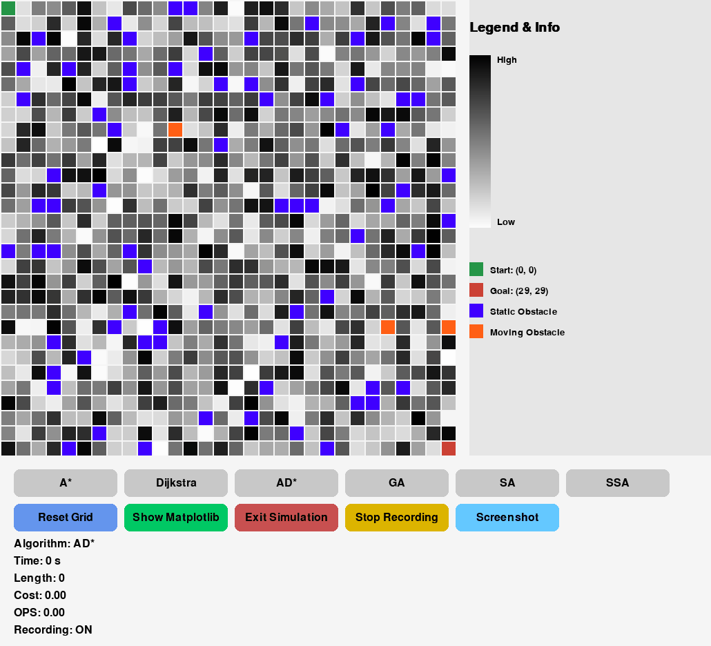

# Pathfinding Optimization in Dynamic Environments
This project compares traditional algorithms (A*, Dijkstra, AD*) with metaheuristic approaches (GA, SA, SSA) for dynamic pathfinding on a grid with moving obstacles.

## Demo


## Features
- **Dynamic environment** with moving obstacles and optional height map.
- **Algorithms implemented**:
  - **Baselines:** Dijkstra, A*, AD* (Anytime Dynamic A*)
  - **Metaheuristics:** Genetic Algorithm (GA), Simulated Annealing (SA), Sparrow Search Algorithm (SSA)
- **Visualization:** Real-time simulation using **Pygame**.
- **Performance metrics:** Path cost, computation time, convergence history.

## Project Structure
 ── pathfinding-optimization
  ├── README.md # Project documentation
  ├── requirements.txt # Python dependencies
  ├── main.py # DEPRICATED - Entry point for the program
  ├── dy_main.py # Entry point for the program
  ├── config.py # Global settings and hyperparameters
  │ ├── algorithms/ # A*, Dijkstra, AD*, GA, SA, SSA
  │ ├── ui/ # Pygame visualization
  │ ├── utils/ # Metrics, path cost functions
  │ ├── environment/ # Grid elements genration function
  │ ├── results/ # Results and demo

## Requirements
- Python 3.8+
- Libraries: pygame, matplotlib, pandas, imageio.

## Installation

Clone the repository:
```bash
git clone https://github.com/<your-username>/pathfinding-optimization.git](https://github.com/AbhiramSankar/PathFinding_Python.git
cd pathfinding-optimization
```
Install dependencies:
```bash
pip install -r requirements.txt
```
How to run:
```bash
python dy_main.py
```
